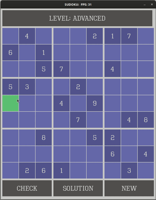

# UDACITY CPP Nano Degree Capstone: Sudoku Game

Sudoku is a logic-based number placement puzzle. The word Sudoku is short for _Su-ji wa dokushin ni kagiru_ which means "the numbers must be single". A 9 by 9 grid partially filled with digits is a starting point. The objective is to fill the grid with the constraint that every row, column, and box (3 by 3 subgrid) must contain all of the digits from 1 to 9. The puzzle has a single solution.

This project solves the sudoku using fast Backtracking (depth-first search) algorithm. The key is to place a number tentatively and find violations, backtrack if there are violations or record the number if none.

## Dependencies for Running Locally
* cmake >= 3.11
  * All OSes: [click here for installation instructions](https://cmake.org/install/)
* make >= 4.1 (Linux) 
  * Linux: make is installed by default on most Linux distros
* SDL2 >= 2.0
  * All installation instructions can be found [here](https://wiki.libsdl.org/Installation)
  >Note that for Linux, an `apt` or `apt-get` installation is preferred to building from source. 
* SDL2_ttf >= 2.0
* gcc/g++ >= 5.4
  * Linux: gcc / g++ is installed by default on most Linux distros
  
## Basic Build Instructions

1. Clone this repo.
2. Make a build directory in the top level directory: `mkdir build && cd build`
3. Compile: `cmake .. && make`
4. Run it: `./SudokuGame`

## Rubric requirements met
1. >Loops, Functions, I/O
    * The project demonstrates an understanding of C++ functions and control structures.
    * The project reads data from a file and process the data, or the program writes data to a file. (see Updater::loadBoard). 
    * The project accepts user input and processes the input (see Controller::handleInput).
2. >Object Oriented Programming
    * The project uses Object Oriented Programming techniques.
    * Classes use appropriate access specifiers for class members.
    * Class constructors utilize member initialization lists.
    * Classes abstract implementation details from their interfaces.
    * Classes follow an appropriate inheritance hierarchy (see Buton and SudokuCell).
3. >Memory Management
    * The project makes use of references in function declarations.
    * The project uses destructors appropriately. (See Renderer)
    * The project uses scope / Resource Acquisition Is Initialization (RAII) where appropriate.
    * The project uses smart pointers instead of raw pointers. (See Main, Renderer)
4. > Concurrency
    * The project uses multithreading (see Game::play in which has Controller::handleInput and Updater::run running in separate threads apart from game play thread).
    * A mutex or lock is used in the project (see Button, SudokuCell, Controller, Updater, and SudokuScoreBoard).
 

## Acknowledgement
1. This project used the starter game repo provided for the capstone project [Udacity Capstone Snake Game Example](https://github.com/udacity/CppND-Capstone-Snake-Game)
2. Thanks to Shing-Yan Loo for his [Pong game repo](https://github.com/yan99033/CppND-Capstone-Pong)
3. Thanks to Ryan Tabar for his [Sudoku game using SDL2 repo](https://github.com/SirFourier/Sudoku-game-using-SDL2)

## CC Attribution-ShareAlike 4.0 International

Shield: [![CC BY-SA 4.0][cc-by-sa-shield]][cc-by-sa]

This work is licensed under a
[Creative Commons Attribution-ShareAlike 4.0 International License][cc-by-sa].

[![CC BY-SA 4.0][cc-by-sa-image]][cc-by-sa]

[cc-by-sa]: http://creativecommons.org/licenses/by-sa/4.0/
[cc-by-sa-image]: https://licensebuttons.net/l/by-sa/4.0/88x31.png
[cc-by-sa-shield]: https://img.shields.io/badge/License-CC%20BY--SA%204.0-lightgrey.svg
